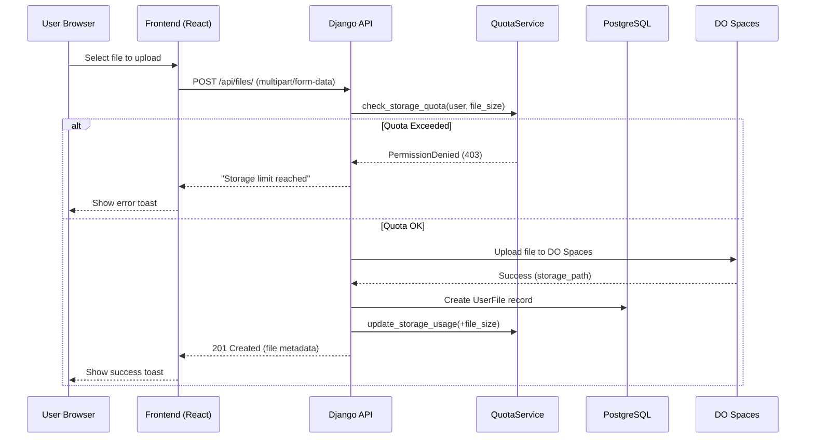
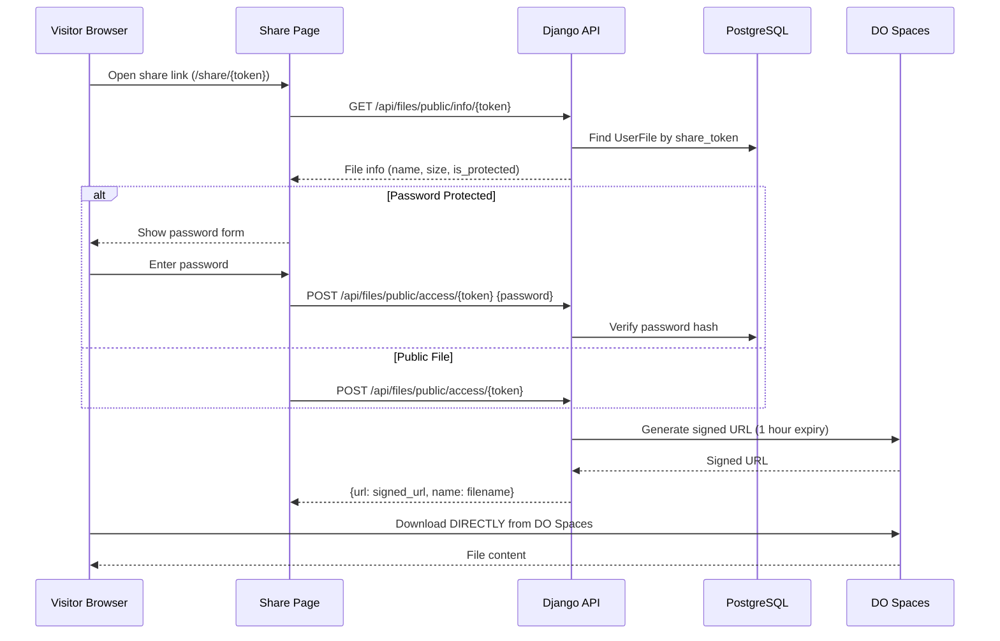

# File Storage & Access Architecture

This document explains how files are stored, managed, and accessed in Ninja-PDF.

## Overview

```
┌─────────────────────────────────────────────────────────────────────────────┐
│                           NINJA-PDF FILE ARCHITECTURE                       │
├─────────────────────────────────────────────────────────────────────────────┤
│                                                                             │
│   ┌──────────┐        ┌──────────────┐        ┌────────────────────────┐   │
│   │  User    │        │   Django     │        │   DigitalOcean Spaces  │   │
│   │ Browser  │◄──────►│   Backend    │◄──────►│   (S3-Compatible)      │   │
│   │ (React)  │        │   API        │        │   Cloud Storage        │   │
│   └──────────┘        └──────────────┘        └────────────────────────┘   │
│                              │                                              │
│                              ▼                                              │
│                       ┌──────────────┐                                      │
│                       │  PostgreSQL  │                                      │
│                       │  (Metadata)  │                                      │
│                       └──────────────┘                                      │
│                                                                             │
└─────────────────────────────────────────────────────────────────────────────┘
```

## Storage Backend

Files are stored on **DigitalOcean Spaces**, an S3-compatible object storage service.

### Configuration (Environment Variables)

```bash
# Storage Backend Type
STORAGE_BACKEND=s3

# DigitalOcean Spaces Credentials
AWS_ACCESS_KEY_ID=<your_access_key>
AWS_SECRET_ACCESS_KEY=<your_secret_key>
AWS_STORAGE_BUCKET_NAME=18pluspdfstorage
AWS_S3_REGION_NAME=sgp1
AWS_S3_ENDPOINT_URL=https://sgp1.digitaloceanspaces.com

# Optional: CDN Domain for faster delivery
AWS_S3_CUSTOM_DOMAIN=18pluspdfstorage.sgp1.cdn.digitaloceanspaces.com
```

---

## File Upload Flow



### Storage Path Structure

Files are stored with the following path pattern:
```
user_files/{YYYY}/{MM}/{DD}/{filename}
```

Example: `user_files/2025/12/23/document.pdf`

---

## File Access Flow (Public Sharing)



### Key Points

1. **Files never pass through the frontend** - The frontend only receives a signed URL
2. **Signed URLs expire** - URLs are valid for 1 hour for security
3. **Direct download** - Browser downloads directly from DigitalOcean Spaces CDN

---

## Storage Quota System

### Tier Limits

| Tier | Storage Limit |
|------|---------------|
| FREE | 100 MB |
| PRO | 500 MB |
| PREMIUM | 2 GB |
| ENTERPRISE | 10 GB |

### Quota Enforcement

```python
# core/services/quota_service.py

class QuotaService:
    @staticmethod
    def check_storage_quota(user, file_size):
        """Raises PermissionDenied if quota exceeded."""
        used, limit = QuotaService.get_storage_quota(user)
        if used + file_size > limit:
            raise PermissionDenied("Storage limit reached")
    
    @staticmethod
    def update_storage_usage(user, delta_bytes):
        """Atomically updates storage usage."""
        sub = user.subscription
        sub.storage_used = F('storage_used') + delta_bytes
        sub.save()
```

### Storage Tracking

- **Subscription.storage_used** - Current bytes used (BigIntegerField)
- **Plan.storage_limit** - Maximum bytes allowed (BigIntegerField)

---

## Core Components

### 1. StorageService (`core/storage.py`)

Unified abstraction layer for all storage operations:

```python
from core.storage import StorageService

# Upload a file
StorageService.upload(path, file_obj)

# Generate signed URL for download
url = StorageService.get_signed_url(path, expiration=3600)

# Delete a file
StorageService.delete(path)

# Check if file exists
exists = StorageService.exists(path)

# Get file size
size = StorageService.get_size(path)
```

### 2. UserFile Model (`apps/files/models/user_file.py`)

```python
class UserFile(models.Model):
    user = models.ForeignKey(User, on_delete=models.CASCADE)
    file = models.FileField(upload_to='user_files/%Y/%m/%d/')
    name = models.CharField(max_length=255)
    size_bytes = models.BigIntegerField(default=0)
    mime_type = models.CharField(max_length=100)
    share_token = models.UUIDField(unique=True)  # For public sharing
    password_hash = models.CharField(null=True)   # Optional protection
    download_count = models.IntegerField(default=0)
    view_count = models.IntegerField(default=0)
```

### 3. API Endpoints

| Method | Endpoint | Description |
|--------|----------|-------------|
| GET | `/api/files/` | List user's files |
| POST | `/api/files/` | Upload a new file |
| DELETE | `/api/files/{id}/` | Delete a file |
| POST | `/api/files/{id}/set_password/` | Add password protection |
| POST | `/api/files/{id}/remove_password/` | Remove password |
| GET | `/api/files/public/info/{token}/` | Get public file info |
| POST | `/api/files/public/access/{token}/` | Get download URL |

---

## Security Features

### 1. Signed URLs
- All file access uses time-limited signed URLs
- URLs expire after 1 hour
- Generated using AWS S3v4 signature

### 2. Password Protection
- Optional password protection for shared files
- Passwords are hashed using Django's `make_password()`
- Verified using `check_password()` before URL generation

### 3. Private by Default
- All files are stored as private in DO Spaces
- `AWS_DEFAULT_ACL = None` (bucket default = private)
- No public access without signed URL

### 4. Quota Enforcement
- Storage limits checked BEFORE upload
- Atomic usage updates prevent race conditions
- Negative usage prevented with refresh check

---

## Frontend Integration

### My Files Page (`/files`)

Displays:
- List of user's files
- Storage usage bar (used / limit in MB)
- Upload dialog
- Share dialog with copy link functionality

### Share Page (`/share/{token}`)

Public page for file access:
- Shows file info (name, size, type)
- Password form if protected
- Preview and Download buttons
- Direct download from DO Spaces

---

## Troubleshooting

### Files not accessible?

1. **Check environment variables** are set correctly
2. **Verify DO Spaces bucket exists** and credentials are valid
3. **Enable CDN** in DigitalOcean Spaces settings
4. **Check CORS settings** in DO Spaces for cross-origin access

### Storage quota not updating?

1. Ensure user has a `Subscription` record
2. Check `Subscription.storage_used` in admin panel
3. Verify `QuotaService.update_storage_usage()` is called after upload/delete

### Signed URLs not working?

1. Check `AWS_S3_ENDPOINT_URL` matches your region
2. Verify `AWS_S3_SIGNATURE_VERSION = 's3v4'` is set
3. Ensure server time is synchronized (signature depends on time)
